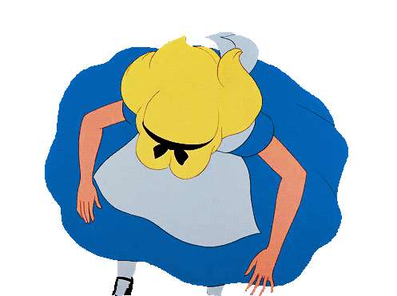

# 🎩 Alice's Adventures in Data Science Wonderland 🐇

Welcome to my whimsical documentation of my journey through the magical realms of Data Science and Deep Learning. Just like Alice, I've embarked on an enchanting adventure filled with curiosity, discovery, and the pursuit of knowledge. 🌟

## About this Documentation 📜

Within these pages, you will find my notes 📝, notebooks 📚, and musings as I traverse the vast landscapes of data exploration, analysis, and modeling. Just like Alice encountered peculiar creatures and unexpected challenges, I, too, have encountered fascinating datasets, complex algorithms, and perplexing concepts. 🌈

## Falling Down the Data Science Rabbit Hole 🕳️

Much like Alice's descent into the rabbit hole, my journey began with a leap into the world of Data Science. I explored the foundations of statistics, probability, and data manipulation, unlocking doors to new dimensions of insights and understanding. With each step, I grew more adept at wrangling data, transforming it into meaningful representations. 📊

## Unraveling the Mysteries of Deep Learning 🔍

As Alice ventured through Wonderland, encountering talking animals and hidden wonders, I delved into the captivating realm of Deep Learning. Neural networks became my magical looking glass, revealing patterns and unveiling the secrets hidden within vast amounts of data. Through the wonder of gradient descent and backpropagation, I trained models that could comprehend images, understand natural language, and even generate artistic masterpieces. 🧠💡

## Notes and Notebooks - My Tea Party with Data ☕📓

In this documentation, you will find my collection of notes and notebooks, akin to Alice's tea party with the Mad Hatter and his eccentric friends. Each note represents a sip of knowledge, capturing insights, methodologies, and best practices that I've acquired along the way. My notebooks serve as enchanted artifacts, showcasing the spells I cast upon the data, transforming it into captivating visualizations and predictive models. 🎩✨

## Curiosity as my Compass 🔍❓

Like Alice, I am driven by an insatiable curiosity that propels me forward in this captivating journey. As I explore new techniques, dive into cutting-edge research papers, and grapple with complex algorithms, I document my findings and observations, hoping to inspire others on their own curious quests. Let's embrace the spirit of curiosity and unlock the wonders hidden within the data! 🌌🔍

## Join the Adventure 🚀

I invite you to join me on this whimsical adventure. Dive into the pages of this documentation, immerse yourself in the notebooks, and embark on your own journey through the captivating realms of Data Science and Deep Learning. Let us embrace the spirit of curiosity and unlock the wonders hidden within the data. Together, we'll create magic! ✨🔮

**"Curiouser and curiouser!" - Alice** 🐇🌼
